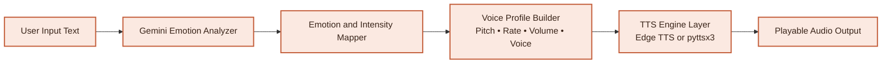
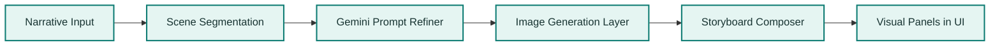

# Darwix AI Studio

Darwix AI Studio is a Flask-based assignment submission that combines both required challenges in one product:

- **Challenge 1: The Empathy Engine**
- **Challenge 2: The Pitch Visualizer**

The app includes login and signup, MongoDB-backed user accounts, expressive text-to-speech with voice selection, and Gemini-powered storyboard generation with styled visual panels.

## Highlights

- Flask web app with login, signup, and dashboard flows
- MongoDB-backed authentication
- Gemini-powered emotion analysis with granular emotions
- Voice selection for male and female voices
- Runtime control over `pitch`, `rate`, and `volume`
- Playable audio output for Challenge 1
- Narrative segmentation, prompt engineering, and styled storyboard generation for Challenge 2
- Animated text-to-speech logo and processing state in the UI
- Fallback behavior for both analysis and image generation

## Project structure

```text
.
|-- darwix_app/
|   |-- __init__.py
|   |-- config.py
|   |-- models.py
|   |-- routes/
|   |   |-- api.py
|   |   `-- web.py
|   |-- services/
|   |   |-- auth_service.py
|   |   |-- database.py
|   |   |-- empathy_engine.py
|   |   |-- emotion_service.py
|   |   |-- storyboard_service.py
|   |   `-- tts_service.py
|   |-- static/
|   |   |-- app.js
|   |   |-- auth.js
|   |   `-- styles.css
|   `-- templates/
|       |-- auth.html
|       `-- dashboard.html
|-- storage/
|   |-- audio/
|   `-- storyboards/
|-- .env
|-- .env.example
|-- requirements.txt
`-- run.py
```

## Setup

1. Create and activate a virtual environment:

```powershell
py -3.11 -m venv .venv
.venv\Scripts\Activate.ps1
```

2. Install dependencies:

```powershell
python -m pip install --upgrade pip
pip install -r requirements.txt
```

3. Create your environment file if needed:

```powershell
Copy-Item .env.example .env
```

4. Make sure `.env` contains:

```env
SECRET_KEY=your_secret
GEMINI_API_KEY=your_gemini_key
GEMINI_MODEL=gemini-2.5-flash
GEMINI_IMAGE_MODEL=gemini-2.0-flash-preview-image-generation
MONGO_URI=your_mongodb_uri
MONGO_DB_NAME=darwix_assignment
```

## Run

```powershell
python run.py
```

Open `http://127.0.0.1:5000`.

## Challenge 1: The Empathy Engine

Input text is analyzed into richer emotional states such as:

- `happy`
- `excited`
- `neutral`
- `concerned`
- `sad`
- `frustrated`
- `angry`
- `inquisitive`
- `surprised`

That emotion is mapped to:

- `pitch`
- `rate`
- `volume`
- selected voice

The app uses Edge TTS so the user can choose a male or female voice and hear more expressive speech than the earlier local prototype.

### Low-Level Design



### Sample I/P -> O/P

| Input | Flow | Output |
|---|---|---|
| **Challenge 1 Input**  \nText: `I found an old brass key in the pocket of my grandfather's coat, its surface worn smooth by time. It had been tucked away for decades, never used, never explained. Curious, I searched the house for a lock it might fit-under floorboards, behind picture frames, even in the attic. Finally, I discovered a small wooden box hidden in the wall, its lid sealed with wax. Inside was a letter, a photograph, and a promise I never knew I'd inherit.`  \nVoice Type: `Female`  \nVoice: `Female - Aria` | `Input Text` -> `Gemini Emotion Analysis` -> `Voice Mapping` -> `Hybrid TTS` -> `Audio Result` | **Challenge 1 Output**  \nEmotion: `surprised`  \nIntensity: `0.85`  \nPitch: `+18.7Hz`  \nRate: `+11.9%`  \nVolume: `+6.8%`  \nAnalysis Provider: `gemini`  \nTTS Provider: `pyttsx3`  \nResult: `Playable emotional audio clip` |

## Challenge 2: The Pitch Visualizer

The app accepts a narrative block, breaks it into scenes, enhances each scene into a more visual prompt with Gemini, and generates a storyboard panel for each scene.

Bonus features included:

- user-selectable visual style
- Gemini prompt refinement
- dynamic storyboard UI
- basic visual consistency through shared style guidance

If image generation fails during runtime, the app creates clean placeholder storyboard panels so the demo can still proceed.

### Low-Level Design



### Sample I/P -> O/P

| Input | Flow | Output |
|---|---|---|
| **Challenge 2 Input**  \nNarrative: `"You ruined my career, I was supposed to be an executive director," she thought to herself. The little angel held her finger tightly and she forgot everything; A mother was born.`  \nVisual Style: `Graphic Novel Storyboard` | `Narrative Input` -> `Scene Segmentation` -> `Gemini Prompt Refinement` -> `Image Generation` -> `Storyboard Board UI` | **Challenge 2 Output**  \nScene 1: emotionally intense opening frame  \nScene 2: intimate close-up of the child holding her finger  \nScene 3: transformation into motherhood and emotional release  \nPresentation: `Marble-slate storyboard board with left/right slide navigation and animated thumbnails`  \nExpected Visual Quality: `cinematic, expressive, photo-rich or high-quality storyboard imagery` |

**Manually Intended Visual Reference For Challenge 2 Output**

The desired output style is not a flat placeholder card. It should look like a strong Gemini-generated cinematic panel sequence, for example:

- Panel 1: a dramatic emotional portrait capturing the line `"You ruined my career"` with tension and introspection
- Panel 2: a tender close-up of the baby's hand holding her finger, soft light, emotional warmth
- Panel 3: a transformation shot showing the emotional shift from ambition and loss toward motherhood and acceptance

The storyboard should appear one panel at a time on the decorative board, with smooth left/right transitions and a thumbnail strip for scene navigation.

## API overview

- `POST /api/auth/signup`
- `POST /api/auth/login`
- `GET /api/voices`
- `POST /api/challenge-1/synthesize`
- `POST /api/challenge-2/storyboard`

## Notes

- `.env` is ignored by Git, so your Gemini key and Mongo URI stay out of version control.
- `edge-tts` depends on network access at runtime.
- Gemini image generation support can vary by key and model availability, so the placeholder fallback is included to keep the assignment demo resilient.
